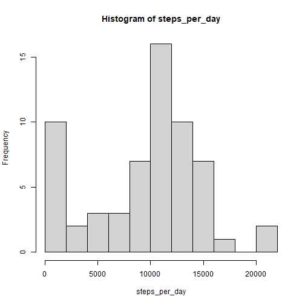
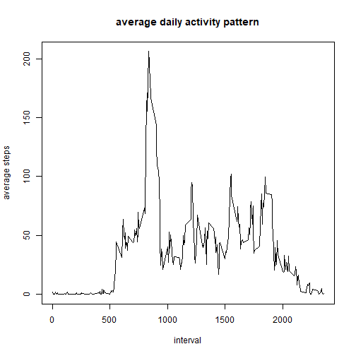
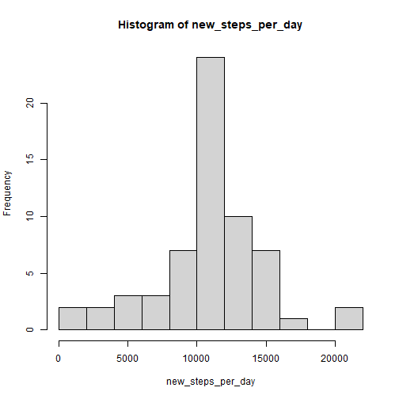
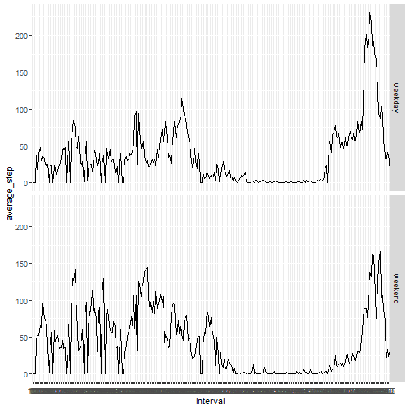

Activity Analysis
---


**Loading and preprocessing the data**

Let's load the data from "activity.csv" into df first.

```r
df <- read.csv("activity.csv")
```

Then let's take a look at the format of each column in df.

```r
str(df)
```

```
## 'data.frame':	17568 obs. of  3 variables:
##  $ steps   : int  NA NA NA NA NA NA NA NA NA NA ...
##  $ date    : chr  "2012-10-01" "2012-10-01" "2012-10-01" "2012-10-01" ...
##  $ interval: int  0 5 10 15 20 25 30 35 40 45 ...
```

The "date" column is in chr format. Let's convert it into Date format before our analysis.

```r
df$date <- as.Date(df$date, "%Y-%m-%d")
```

Now the "date" column is in Date format.

```r
str(df)
```

```
## 'data.frame':	17568 obs. of  3 variables:
##  $ steps   : int  NA NA NA NA NA NA NA NA NA NA ...
##  $ date    : Date, format: "2012-10-01" ...
##  $ interval: int  0 5 10 15 20 25 30 35 40 45 ...
```


**What is mean total number of steps taken per day?**

1. Calculate the total number of steps taken per day

```r
steps_per_day <- with(df, tapply(steps, date, sum, na.rm=TRUE))
```

2. Plot a histogram of the total number of steps taken each day

```r
hist(steps_per_day, breaks=11)
```



3. Let's take a look at the mean and median of the total number of steps taken per day

```r
mean <- mean(steps_per_day)
median <- median(steps_per_day)
```
The mean is 9354.2295082 and the median is 10395.


**What is the average daily activity pattern?**

1. Make a time series plot of the 5-minute interval (x-axis) and the average number of steps taken, averaged across all days (y-axis)

```r
avg_steps_per_interval <- with(df, tapply(steps, interval, mean, na.rm=TRUE))
plot(names(avg_steps_per_interval), avg_steps_per_interval, type="l", xlab="interval", ylab="average steps", main="average daily activity pattern")
```



2. Which 5-minute interval, on average across all the days in the dataset, contains the maximum number of steps?

```r
names(which.max(avg_steps_per_interval))
```

```
## [1] "835"
```
From the output of the above code, the 08:35am 5-minute interval contains the maximum number of steps.


**Imputing missing values**

1. Calculate and report the total number of missing values in the dataset (i.e. the total number of rows with NAs)

```r
NAs <- is.na(df$steps)
num_of_na <- sum(NAs)
```
The total number of NAs are 2304.

2. Devise a strategy for filling in all of the missing values in the dataset.
I will use the mean of that 5-minute interval to fill in all the missing values in the dataset.

3. Create a new dataset "new_df" that is equal to the original dataset "df" but with the missing data filled in.

```r
avg_steps_per_interval_df <- data.frame(interval=names(avg_steps_per_interval), avg_steps=round(avg_steps_per_interval))
new_df <- merge(df, avg_steps_per_interval_df, by="interval")
new_df$steps[is.na(new_df$steps)] <- new_df$avg_steps[is.na(new_df$steps)]
new_df <- new_df[, 1:3]
new_df <- new_df[order(new_df$date, new_df$interval), c("steps", "date", "interval")]
head(new_df)
```

```
##     steps       date interval
## 1       2 2012-10-01        0
## 63      0 2012-10-01        5
## 128     0 2012-10-01       10
## 205     0 2012-10-01       15
## 264     0 2012-10-01       20
## 327     2 2012-10-01       25
```

4. Make a histogram of the total number of steps taken each day and Calculate and report the mean and median total number of steps taken per day. Do these values differ from the estimates from the first part of the assignment? What is the impact of imputing missing data on the estimates of the total daily number of steps?

```r
new_steps_per_day <- with(new_df, tapply(steps, date, sum))
hist(new_steps_per_day, breaks=11)
```



```r
new_mean <- mean(new_steps_per_day)
new_median <- median(new_steps_per_day)
```
After filling in the NAs in the original dataset, the new mean of total number of steps taken per day is 1.0765639 &times; 10<sup>4</sup>, which is larger than the original mean 9354.2295082. And the median of total number of steps taken per day is 1.0762 &times; 10<sup>4</sup>, which is larger then the original median 10395.


**Are there differences in activity patterns between weekdays and weekends?**

1. Create a new factor variable "day_of_week" in the dataset with two levels – “weekday” and “weekend” indicating whether a given date is a weekday or weekend day.

```r
weekends <- c("Sat", "Sun")
new_df$day_of_week <- factor((weekdays(new_df$date, abbreviate=TRUE) %in% weekends), levels=c(TRUE, FALSE), labels=c("weekend", "weekday"))
```

2. Make a panel plot containing a time series plot (i.e. type = "l") of the 5-minute interval (x-axis) and the average number of steps taken, averaged across all weekday days or weekend days (y-axis).

```r
library(ggplot2)

new_weekdays <- subset(new_df, day_of_week == "weekday")
new_weekday_avg_steps_per_interval_table <- with(new_weekdays, tapply(steps, interval, mean))
new_weekday_avg_steps_per_interval <- data.frame(interval=names(new_weekday_avg_steps_per_interval_table), average_step=new_weekday_avg_steps_per_interval_table, day_of_week="weekday")

new_weekends <- subset(new_df, day_of_week == "weekend")
new_weekend_avg_steps_per_interval_table <- with(new_weekends, tapply(steps, interval, mean))
new_weekend_avg_steps_per_interval <- data.frame(interval=names(new_weekend_avg_steps_per_interval_table), average_step=new_weekend_avg_steps_per_interval_table, day_of_week="weekend")

new_avg_steps_per_interval <- rbind(new_weekday_avg_steps_per_interval, new_weekend_avg_steps_per_interval)

qplot(interval, average_step, data=new_avg_steps_per_interval, group=day_of_week, facets=day_of_week~., geom="line")
```


